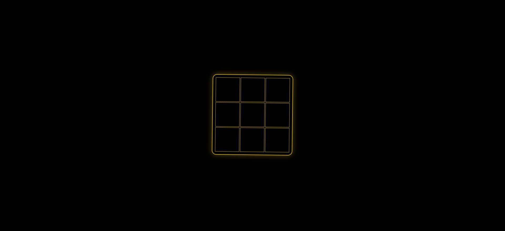

# Golden Tic-Tac-Toe ✨

A premium, floating, gold-themed Tic-Tac-Toe game built using HTML, SCSS, and JavaScript.  
The board features glowing gold borders, smooth animations, and a center-screen winner announcement for a clean and modern experience.

---

## 🎮 Play the Game  
Try it live here:  
👉 **https://kushal255.github.io/Tic-Tac-Toe/**

---

## ✨ Features

- 🟡 Elegant **black & gold theme**
- 🌌 Floating board animation 
- ✨ Glowing golden X and O
- 🎉 Centered animated winner message
- 📱 Fully responsive – works perfectly on mobile and desktop
- ⚡ Smooth interactions with clean game logic
- 🔮 Pure HTML + CSS + JavaScript 

---

## 🛠️ Tech Stack

- **HTML5** – structure of the game  
- **SCSS / CSS3** – style, animations, glow effects  
- **JavaScript** – game logic (turns, win detection, draw logic)

---

## 📂 Project Structure
index.html
style.scss
style.css
script.js
README.md

---

## 🚀 How to Run Locally

1. Clone this repository  
2. Open the folder  
3. Run `index.html` in any browser  
4. Play!

---

## 📸 Screenshot 

---

## 👤 Author

Created by **Kushal Koradia**  
✨ Always learning. Always building.

